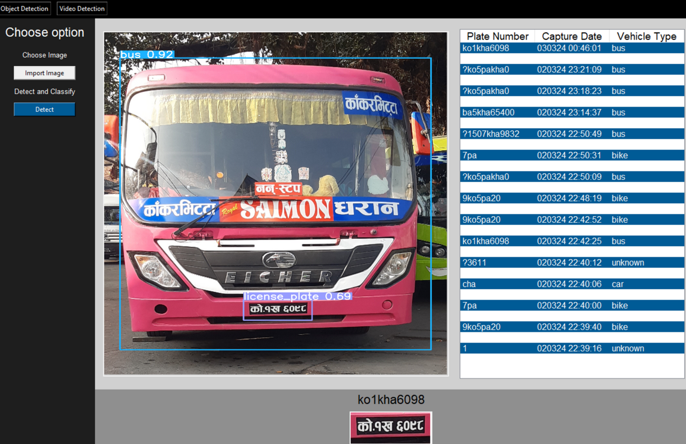
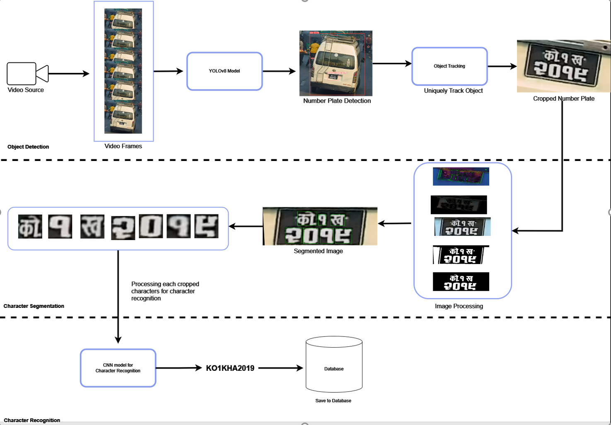

### Nepali Number Plate Recognition

Minor Project TU IOE BE (Computer Engineering): Nepali number plate recognition

**Steps**:
- Prepare the dataset containing Nepali numbers.
- Train a deep learning model (CNN) using TensorFlow for character classification
- YOLO version 8 model train on custom dataset for number plate detection
- Tkinter app for interface

### Demo
Inference on a single image, its prediction result and db storage.

Inference on video (10fps)

### Application workflow
Overall application components from start to the end of the app.

#### 1. video capture using opencv and fed into the yolov8 for object detection.

#### 2. Locate the unique plate and crop the ROI for character segmentation.

#### 3. Character Segmentation process:
- Image Transformation
- Perspective Transform
- Image Cleaning
- Contour Detection
- Character Isolation

#### 4. Character classification
- character classification model trained on 17 class on Nepali vehicle characters e.g [1,2,3,"Me","Pa","Ko",...]

### 5. Saving the result to database